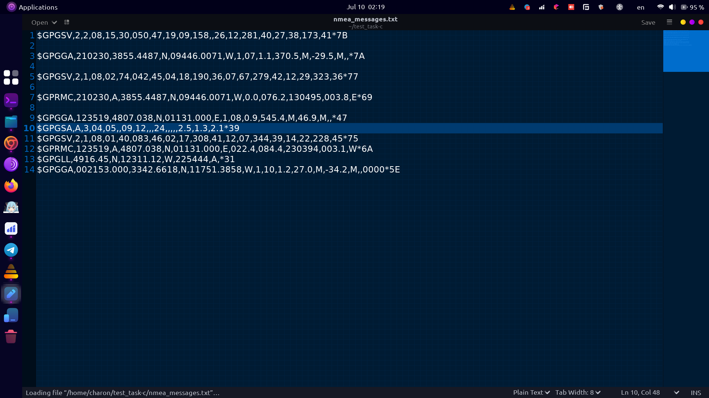

# NMEA GPGGA Message Processor

This project is designed to process NMEA GPGGA messages from a text file. The program extracts and validates critical data such as time, latitude, longitude, and satellite count from each GPGGA message and outputs this information to the console.




## Features

- Reads NMEA GPGGA messages from a file.
- Extracts and validates time, latitude, longitude, and satellite count.
- Handles errors for invalid data and ensures proper formatting and validation.
- Outputs the processed data to the console.

## File Structure

- `main.c`: The main C source file containing the implementation of the NMEA GPGGA message processing.
- `nmea_messages.txt`: The input text file containing NMEA messages.

## Usage

1. **Compile the Program:**
   Use a C compiler to compile the program. For example, using `gcc`:
   ```sh
   gcc -o nmea_processor main.c
   ```

2. **Prepare the Input File:**
   Ensure that your input file `nmea_messages.txt` is in the same directory as the compiled executable. The file should contain NMEA messages, one per line.

3. **Run the Program:**
   Execute the compiled program:
   ```sh
   ./nmea_processor
   ```

4. **Output:**
   The program will output the extracted and validated data to the console. If any errors are encountered during processing, appropriate error messages will be displayed.

## Example

### Input (`nmea_messages.txt`):
```
$GPGGA,123519,4807.038,N,01131.000,E,1,08,0.9,545.4,M,46.9,M,,*47
$GPGGA,invalid message
$GPGGA,225444,3731.234,S,14507.567,W,1,12,0.8,12.0,M,-34.0,M,,*75
```

### Output:
```
Time: 12:35:19.000, Latitude: 4807.038N, Longitude: 01131.000E, Satellites: 8
Error: Invalid message type
Time: 22:54:44.000, Latitude: 3731.234S, Longitude: 14507.567W, Satellites: 12
```

## License

This project is licensed under the MIT License. See the [LICENSE](LICENSE) file for details.

## Contributions

Contributions are welcome! Please fork this repository and submit a pull request for any enhancements or bug fixes.

## Contact

For any questions or suggestions, please feel free to contact me at [sarhadiesmail@gmail.com].
